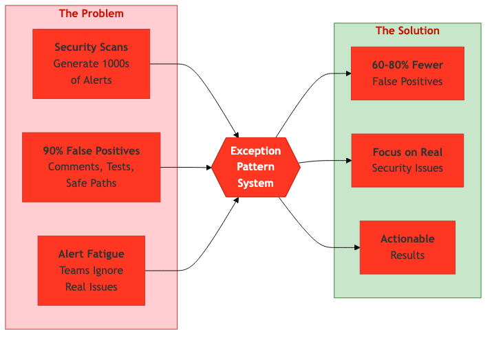
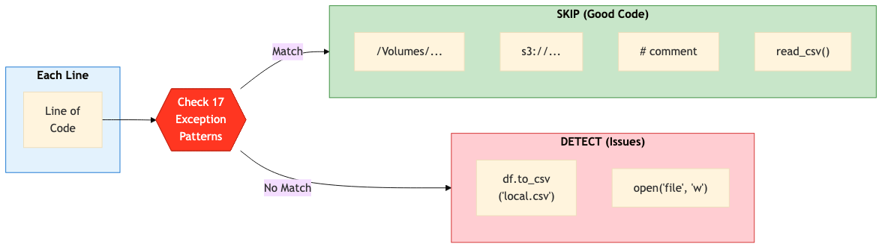
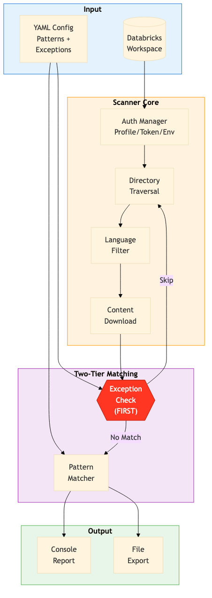

# How We Reduced Security Scan Noise by 80% in Databricks Workspaces

*A Python tool that makes workspace security audits actually usable*

---

## The Security Scan Problem Nobody Talks About

Last month, I ran a security scan on a production Databricks workspace. The result? **2,847 alerts**. My heart sank.

After spending 3 hours manually reviewing results, I discovered something frustrating: **over 90% were false positives**. Comments containing code examples. Test files with mock data. Read operations flagged as writes. Paths using Unity Catalog Volumes (the *correct* approach) getting flagged alongside actual issues.

Sound familiar?

This is the dirty secret of security scanning: most tools generate so much noise that teams either ignore the results entirely or spend more time filtering false positives than fixing real issues. Alert fatigue is real, and it's dangerous.


*The Exception Pattern System transforms noisy security scans into actionable results.*

I built a tool that solves this. It's called the **Databricks Workspace Security Scanner**, and its secret weapon is an **exception pattern system** that reduces false positives by 60-80%.

---

## What You'll Learn

**For Security Teams** — 5 min read
Why traditional regex scanning fails and how exception patterns fix it

**For Platform Engineers** — 10 min read
How to deploy and configure the scanner for your organization

**For Developers** — 15 min read
The technical architecture and how to customize patterns for your needs

---

## For Security Teams: The 2-Minute Summary

Traditional security scanners use simple regex patterns to find issues. The problem? They match *everything* that looks suspicious, including perfectly safe code.

**Without Exception Patterns:**
- Security scan generates 2,847 alerts
- 90% are false positives (comments, tests, safe paths)
- Team spends 10+ hours triaging
- Alert fatigue sets in
- Real issues get missed

**With Exception Patterns:**
- Same scan generates 284 alerts
- 80% are real issues requiring action
- Team triages in 1-2 hours
- Focus on actual security problems
- Better coverage, less noise

The key insight: **check what to skip *before* checking what to flag**.


*Every line is checked against 17 exception categories first. Only lines that don't match any exception are flagged.*

> **Security Team Action Item:** Request a pilot scan of one workspace using this tool. Compare alert quality vs. your current scanner.

---

## For Platform Engineers: 15-Minute Installation

### Prerequisites

- Python 3.8+
- Databricks workspace access (personal access token or CLI profile)
- Network access to Databricks APIs

### One-Command Installation with uv (Recommended)

The scanner uses **uv** for dependency management. No virtual environment setup needed.

```bash
# Install uv (if not already installed)
curl -LsSf https://astral.sh/uv/install.sh | sh

# Clone the repository
git clone https://github.com/LaurentPRAT-DB/databricks_code_scan.git
cd databricks_code_scan

# Run immediately - uv handles dependencies automatically
uv run scan_databricks_workspace.py --help
```

### Configure Authentication

The scanner supports multiple authentication methods:

```bash
# Method 1: Databricks CLI profile (recommended)
databricks configure --profile production
uv run scan_databricks_workspace.py --profile production

# Method 2: Environment variables
export DATABRICKS_HOST="https://your-workspace.cloud.databricks.com"
export DATABRICKS_TOKEN="your-personal-access-token"
uv run scan_databricks_workspace.py

# Method 3: Direct credentials
uv run scan_databricks_workspace.py \
  --host "https://your-workspace.cloud.databricks.com" \
  --token "your-token"
```

### Run Your First Security Scan

```bash
# Basic security scan with exception filtering
uv run scan_databricks_workspace.py \
  --profile production \
  --language python \
  --config patterns_python_local_writes.yaml \
  --output security_scan_$(date +%Y%m%d).txt
```

**Sample Output:**

```
Connected to workspace as: admin@company.com
Workspace URL: https://production.cloud.databricks.com
Loaded 17 exception pattern(s) from config
Loaded 50 pattern(s) from config

Compiling 17 exception pattern(s)...
  ✓ Exception: /Volumes/[^"'\s]+...
  ✓ Exception: s3a?://[^"'\s]+...

Scanning Databricks workspace starting from: /
Found 1,247 source code files
Found 156 pattern match(es)

Pattern Matches (156 total):
================================================================================
/Users/john.doe/ETL_Pipeline (3 matches):
  Line 45: df.to_csv("output.csv")
  Line 89: model.save("trained_model.h5")
```

> **Platform Engineer Action Item:** Set up the scanner in your CI/CD pipeline to run weekly scans with results sent to your security team.

---

## For Developers: The Technical Deep Dive

### Architecture Overview


*The two-tier matching system: exceptions are checked FIRST, then patterns are applied only to non-exception lines.*

The scanner follows a clear data flow:

1. **Authentication**: Connect to Databricks using SDK with multiple auth options
2. **Directory Traversal**: Recursively scan workspace starting from specified path
3. **Language Filtering**: Only process files matching target languages (default: Python)
4. **Content Download**: Fetch file content via Databricks API
5. **Exception Checking**: For each line, check 17 exception patterns FIRST
6. **Pattern Matching**: Apply detection patterns only to non-exception lines
7. **Reporting**: Generate grouped results with line numbers and context

### The Exception Pattern System

This is where the magic happens. Instead of post-filtering results, we **skip lines before flagging** them.

```yaml
# exceptions checked FIRST (skip these)
exceptions:
  - "/Volumes/[^\"'\\s]+"     # Unity Catalog Volumes (GOOD)
  - "s3://[^\"'\\s]+"         # Cloud storage (GOOD)
  - "^\\s*#.*"                # Comments (documentation)
  - "read_csv\\s*\\("         # Read operations (not writes)

# patterns checked AFTER exceptions
patterns:
  - "df\\.to_csv\\s*\\(\\s*[\"'][^/][^\"']*[\"']"
  - "model\\.save\\s*\\(\\s*[\"'][^/][^\"']*[\"']"
```

### Built-in Exception Categories (17 Total)

| Category | Example | Why Skip |
|----------|---------|----------|
| Unity Catalog Volumes | `/Volumes/cat/schema/vol/` | Recommended storage |
| Cloud Storage | `s3://`, `abfss://`, `gs://` | Direct cloud access |
| System Temp | `/tmp/processing.csv` | Legitimate temp files |
| Comments | `# df.to_csv("file.csv")` | Documentation |
| Docstrings | `"""Example: model.save()"""` | Code examples |
| Variable Assignments | `filename = "output.csv"` | String literal, not operation |
| f-strings with Variables | `f"{base_path}/file.csv"` | May be absolute at runtime |
| Read Operations | `pd.read_csv('./data.csv')` | Not writes |
| Test Paths | `/tests/test_file.py` | Test data and mocks |

### Example: What Gets Skipped vs. Detected

```python
# ✅ SKIPPED (Exception: Unity Catalog Volume - CORRECT usage)
df.to_csv("/Volumes/catalog/schema/volume/output.csv")

# ✅ SKIPPED (Exception: Cloud storage - acceptable)
df.to_csv("s3://my-bucket/data/output.csv")

# ✅ SKIPPED (Exception: Comment - documentation)
# Example: df.to_csv("output.csv")

# ✅ SKIPPED (Exception: Read operation - not a write)
df = pd.read_csv('./input.csv')

# 🔴 DETECTED (No exception - PROBLEMATIC)
df.to_csv("output.csv")  # Writes to ephemeral CWD!

# 🔴 DETECTED (No exception - PROBLEMATIC)
with open("data.txt", "w") as f:  # Local file write!
    f.write(content)
```

### Adding Custom Exceptions

Your organization probably has approved storage locations or wrapper functions. Add them to the config:

```yaml
exceptions:
  # Built-in exceptions (keep these)
  - "/Volumes/[^\"'\\s]+"
  - "s3://[^\"'\\s]+"

  # Your organization's approved paths
  - "/mnt/approved-storage/[^\"'\\s]+"
  - "adl://company-lake\\.azuredatalakestore\\.net/[^\"'\\s]+"

  # Your safe wrapper functions
  - "safe_save_dataframe\\s*\\("
  - "company_export_util\\.save\\s*\\("
```

### Performance Considerations

| Workspace Size | Without Patterns | With Patterns |
|----------------|------------------|---------------|
| Small (<1K files) | 5-10 seconds | 30-60 seconds |
| Medium (1K-10K) | 30-60 seconds | 5-15 minutes |
| Large (>10K files) | 2-5 minutes | 15-60 minutes |

**Optimization Tips:**
- Use `--language python` to filter files (default)
- Use `--path /Users/specific.team` to limit scope
- Enable `--threads 10` for parallel scanning
- Run scans during off-peak hours

---

## Try It Yourself: 3 Paths

### Path 1: Quick Test (5 minutes)

```bash
# Clone and run immediately
git clone https://github.com/LaurentPRAT-DB/databricks_code_scan.git
cd databricks_code_scan
uv run scan_databricks_workspace.py --profile YOUR_PROFILE --path /Users/YOUR_EMAIL
```

### Path 2: Full Security Audit (15 minutes)

```bash
# Complete workspace scan with exception filtering
uv run scan_databricks_workspace.py \
  --profile production \
  --language python \
  --language sql \
  --config patterns_python_local_writes.yaml \
  --verbose \
  --output full_audit_$(date +%Y%m%d).txt
```

### Path 3: CI/CD Integration

Add to your pipeline to run weekly scans:

```yaml
# .github/workflows/security-scan.yml
name: Databricks Security Scan
on:
  schedule:
    - cron: '0 6 * * 1'  # Every Monday at 6 AM

jobs:
  scan:
    runs-on: ubuntu-latest
    steps:
      - uses: actions/checkout@v4
      - name: Install uv
        run: curl -LsSf https://astral.sh/uv/install.sh | sh
      - name: Run Security Scan
        env:
          DATABRICKS_HOST: ${{ secrets.DATABRICKS_HOST }}
          DATABRICKS_TOKEN: ${{ secrets.DATABRICKS_TOKEN }}
        run: |
          uv run scan_databricks_workspace.py \
            --config patterns_python_local_writes.yaml \
            --output scan_results.txt
      - name: Upload Results
        uses: actions/upload-artifact@v4
        with:
          name: security-scan-results
          path: scan_results.txt
```

---

## Common Gotchas

### Gotcha 1: "Path doesn't exist" with wildcards

**Cause:** Shell expansion happens locally before the script runs.

**Solution:** Always quote wildcard paths:

```bash
# ❌ Wrong - shell expands against local filesystem
uv run scan_databricks_workspace.py --path /Users/laurent*

# ✅ Correct - quotes prevent shell expansion
uv run scan_databricks_workspace.py --path "/Users/laurent*"
```

### Gotcha 2: Too many timeouts during parallel scans

**Cause:** API rate limiting with too many concurrent requests.

**Solution:** Reduce thread count:

```bash
# Start with default (10 threads), reduce if timeouts occur
uv run scan_databricks_workspace.py --threads 5 ...
```

### Gotcha 3: Pattern not matching expected code

**Cause:** Regex escaping issues in YAML.

**Solution:** Test patterns separately:

```python
import re
pattern = r'\.to_csv\s*\(\s*["\''][^/][^"\']*["\']'
test_line = 'df.to_csv("output.csv")'
print(re.search(pattern, test_line))  # Should match
```

---

## Use Cases Beyond Security

The scanner isn't just for security audits:

**Unity Catalog Migration:**
Find all code using deprecated DBFS paths:

```bash
uv run scan_databricks_workspace.py \
  --config patterns_cwd_file_writes.yaml \
  --output uc_migration_candidates.txt
```

**Code Quality Reviews:**
Find TODO/FIXME comments across the workspace:

```bash
uv run scan_databricks_workspace.py \
  --pattern "TODO:" \
  --pattern "FIXME:" \
  --pattern "HACK:" \
  --output code_quality_review.txt
```

**Compliance Audits:**
Custom patterns for organizational policies:

```bash
uv run scan_databricks_workspace.py \
  --config compliance_patterns.yaml \
  --group-by-type \
  --output compliance_audit.txt
```

---

## Resources

- **GitHub Repository:** [github.com/LaurentPRAT-DB/databricks_code_scan](https://github.com/LaurentPRAT-DB/databricks_code_scan)
- **Exception Patterns Guide:** [EXCEPTION_PATTERNS_GUIDE.md](https://github.com/LaurentPRAT-DB/databricks_code_scan/blob/main/EXCEPTION_PATTERNS_GUIDE.md)
- **Pattern Usage Guide:** [PATTERNS_USAGE.md](https://github.com/LaurentPRAT-DB/databricks_code_scan/blob/main/PATTERNS_USAGE.md)
- **Databricks Unity Catalog Volumes:** [Databricks Documentation](https://docs.databricks.com/en/connect/unity-catalog/volumes.html)

---

## About the Author

*Laurent Prat is a Solutions Architect at Databricks, helping customers build secure, scalable data platforms. When not hunting for hardcoded credentials in notebooks, he's probably automating something that shouldn't be automated.*

---

**Did this help?** Give it a clap and follow for more Databricks security and automation content.

*Tags: #Databricks #Security #Python #DataEngineering #DevSecOps*
